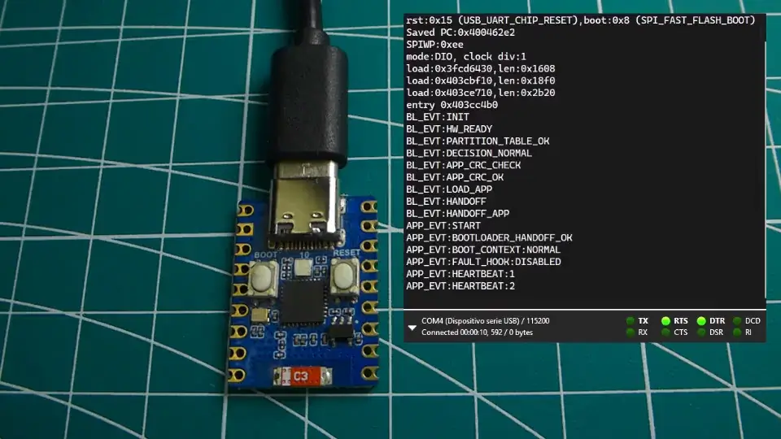
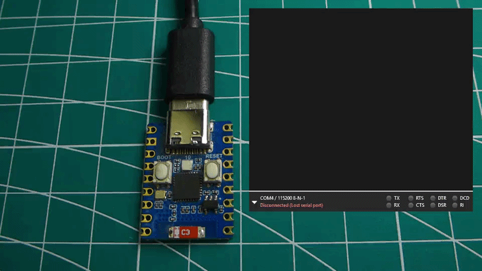

# Waveshare ESP32-C3 Zero Custom Bootloader
[](https://opensource.org/licenses/MIT)&nbsp;&nbsp;
[](https://github.com/ElToroDM/exerionbit-esp32c3-bootloader/actions)&nbsp;&nbsp;
[](https://www.espressif.com/en/products/socs/esp32-c3)&nbsp;&nbsp;
[](https://github.com/ElToroDM/exerionbit-esp32c3-bootloader/issues)&nbsp;&nbsp;

Minimal ESP-IDF bootloader for the Waveshare ESP32-C3 Zero board.

Boot flow aligned with BRS-B principles (RISC-V ecosystem, ratified 2025): minimal, standardized handoff, no heavy UEFI/ACPI stack.
Scope note: this repository demonstrates baseline alignment, not full production hardening or full standards conformance.

This repository shows a minimal ESP32-C3 bootloader implementation on real hardware, with deterministic boot-path behavior, validation evidence, and explicit scope limits.



## Scope

What this repository demonstrates:
- Deterministic ESP32-C3 second-stage boot behavior on real hardware
- Explicit boot decision states with stable serial tokens and LED mapping
- Reproducible normal path and selector-driven mode decisions suitable for audit-style review

Not included:
- Advanced production hardening internals
- Full key management architecture
- Client-specific anti-tamper implementation details

## Quick demo

1. Build and flash using ESP-IDF.
2. Capture logs with `scripts/watch_serial.py`.
3. Validate token sequence with the validation profile (`VALIDATION_PROFILE.md`).
4. Optional: hold `GPIO9` at boot to enter selector and verify mode tokens (`MODE_SELECT_ARMED`, `MODE_SELECTED`, `MODE_EXECUTE`).
5. Optional: test CRC validation via `SETUP.md` (CRC OK path and CRC failure path with recovery).

## Known limits

- Live validation requires physical ESP32-C3 hardware access
- Native USB re-enumeration can hide very early boot lines without watcher tooling
- The published boot sequence includes deliberate visual/reconnect delays to make LED states and late boot tokens easy to observe; production-oriented builds would usually shorten or remove them
- Repository documentation covers baseline behavior, not full production hardening

## Evidence and Media

- Canonical evidence pack: [docs/evidence/v0.2/expected-vs-observed.md](docs/evidence/v0.2/expected-vs-observed.md)
- Normal boot demo:

    [](docs/media/v0.2/waveshare-esp32-c3-zero-custom-bootloader-normal-boot.mp4)

    Direct video file: [docs/media/v0.2/waveshare-esp32-c3-zero-custom-bootloader-normal-boot.mp4](docs/media/v0.2/waveshare-esp32-c3-zero-custom-bootloader-normal-boot.mp4)
- Recovery/update serial evidence: [recovery_commands.log](docs/evidence/v0.2/logs/recovery_commands.log) and [recovery_update.log](docs/evidence/v0.2/logs/recovery_update.log)
- Build instructions target ESP-IDF 6.0.
- The current v0.2 evidence set was captured on 2026-03-11.

## Need / Scope / Timeline

| Need | Typical timeline | Includes | Evidence artifact |
|---|---|---|---|
| UART/serial update baseline | 1-2 days | Deterministic transport + CRC path + logs | `docs/evidence/<release>/logs/recovery_update.log` |
| Factory/recovery baseline | 3-5 days | GPIO trigger + selector tokens + LED diagnostics | `docs/evidence/<release>/expected-vs-observed.md` |
| Lightweight secure baseline | 5-10 days | Integrity/signature baseline mapping + BRS-B principles note | `docs/evidence/<release>/compliance-baseline.md` |

For all engagements: `exerionbit.diego@gmail.com`

## Standards alignment

- BRS-B principles alignment: minimal boot flow, explicit handoff contract, no heavy UEFI/ACPI dependency.
- Scope note: this repository is not a full BRS/BRS-B conformance claim.
- Reference: RISC-V BRS ratification (2025), last checked 2026-03-18.

## Hardware
- **Board**: Waveshare ESP32-C3 Zero
- **SoC**: ESP32-C3FH4 (RISC-V, 160MHz)
- **Flash**: 4MB onboard
- **USB**: USB-CDC (no external USB-UART chip)
- **BOOT**: GPIO9 (manual sequence required)

## Manual Boot Sequence
To flash the board:
1. Press and hold **BOOT** button (GPIO9)
2. Press and release **RESET** button
3. Release **BOOT** button
4. Run flash command

## Quick Start

### Automated setup (recommended)

1. Install ESP‑IDF v6.0 (or use VS Code ESP‑IDF extension).
2. See [SETUP.md](SETUP.md) for one-time PowerShell profile setup that configures all paths, tools, and convenience wrappers.
3. After setup, use any of:
   - **VS Code**: ESP‑IDF extension → Build → Flash → Monitor
    - **PowerShell**: `idf build` / `idf flash` / `idf monitor`
    - Optional port override: `idf -p <PORT> flash` / `idf -p <PORT> monitor`


### Manual setup (if not using profile)

In PowerShell:
```powershell
$env:IDF_PATH = 'C:\esp\v6.0\esp-idf'
$env:IDF_TOOLS_PATH = 'C:\Espressif\tools'
. "$env:IDF_PATH\export.ps1"
idf.py build
```

See [SETUP.md](SETUP.md) for full environment details, toolchain paths, and troubleshooting.

---

## Expected Boot Messages
Look for these in the serial monitor:

Normal path (ordered):
- `BL_EVT:INIT`
- `BL_EVT:HW_READY`
- `BL_EVT:PARTITION_TABLE_OK`
- `BL_EVT:DECISION_NORMAL`
- `BL_EVT:APP_CRC_CHECK`
- `BL_EVT:APP_CRC_OK`
- `BL_EVT:LOAD_APP`
- `BL_EVT:HANDOFF`
- `BL_EVT:HANDOFF_APP`
- `APP_EVT:START`
- `APP_EVT:BOOTLOADER_HANDOFF_OK`

Selector/update path (`GPIO9`):
- `BL_EVT:MODE_SELECT_ARMED`
- `BL_EVT:MODE_SELECTED:UPDATE` (and mode cycling on short press)
- `BL_EVT:MODE_EXECUTE:UPDATE` (long press)
- `BL_EVT:DECISION_UPDATE` is emitted when update mode is executed.
- Update protocol is implemented in this repository:
    - host sends `START_UPDATE`
    - device emits `READY_FOR_CHUNK`
    - host sends `[LEN:OFFSET:CRC16]` + payload
    - device emits `CHUNK_OK:<offset>` or `CHUNK_FAIL:<offset>`
    - host sends `END_UPDATE`
    - device runs app CRC gate and either hands off (`APP_CRC_OK`) or stays in recovery (`APP_CRC_FAIL`).

Recovery command path:
- `BL_EVT:DECISION_RECOVERY`
- no `BL_EVT:HANDOFF_APP` while recovery is active
- UART command parser is implemented (`status`, `reboot`, `update`, `erase`, `boot`, `?`, `h`, `help`)
- command responses are deterministic single-line `BL_RSP:*`
- idle liveness is visual-only (gentle violet LED blink)

## USB serial behavior

ESP32-C3 native USB CDC disconnects during reset. Early ROM and bootloader output is invisible to `idf monitor` until the app reinitializes USB.

For early complete boot capture, use `idf monitor` (default tool). For long-running logging with timestamps and file output, use `python scripts/watch_serial.py` (note: starts logging after initial bootloader events already pass).

Example:
```powershell
python scripts/watch_serial.py --inactivity 10
```

See [SETUP.md](SETUP.md) for full setup, watcher flags, and troubleshooting.

---

## Validation profile

This repository provides a minimal bootloader demo and instructions for building and flashing on the Waveshare ESP32-C3 Zero.

**Boot sequence specification**: See [BOOT_SEQUENCE.md](BOOT_SEQUENCE.md) for complete LED mapping, timing budget, and serial token definitions.

Validation defaults:
- Serial port auto-detection enabled by default
- Total validation timeout: `10s`
- Manual port override remains available
- Protocol PASS/FAIL is based on deterministic boot/app token checks.

## Project Structure
```
./
├── CMakeLists.txt              # Top-level project (includes bootloader_components, app_test)
├── sdkconfig.defaults          # Minimal bootloader config
├── partitions.csv              # Partition table (NVS + factory app)
├── app_test/
│   ├── CMakeLists.txt
│   └── main.c                  # Validation/integration app
├── bootloader_components/
│   └── main/                   # ← Custom bootloader (replaces ESP-IDF default)
│       ├── CMakeLists.txt
│       └── main.c              # Custom call_start_cpu0() implementation
└── scripts/
    └── watch_serial.py         # Serial monitoring with USB reconnection handling
```

## Key Implementation Details
- **Custom bootloader**: `bootloader_components/main/main.c` contains our `call_start_cpu0()`
- **Component override**: Our `main` component replaces ESP-IDF's default bootloader main
- **USB handling**: Scripts handle ESP32-C3 USB reenumeration during reset
- **Build verification**: Bootloader size snapshot tracked in [docs/evidence/v0.2/size_report.txt](docs/evidence/v0.2/size_report.txt)

## Configuration Notes
- Secure Boot: **not included** (development build)
- Flash Encryption: **not included** (development build)
- Bootloader Log Level: **ERROR** (reduce noise)
- Partition Table Offset: **0x8000** (default)
- Compiler Optimization: **Size (-Os)**

## Future Extensions
- Full app payload CRC verification (beyond descriptor-level baseline)
- OTA update support (add ota_0, ota_1, otadata partitions)
- Image signature verification
- JTAG debugging (add ESP-PROG probe)
- USB DFU mode

## Contact

- Open an issue for ESP32-C3 bootloader bring-up work
- Email: `exerionbit.diego@gmail.com`
- Web: `https://www.exerionbit.com`
- See `BOOT_SEQUENCE.md` and `VALIDATION_PROFILE.md` for the canonical contract
